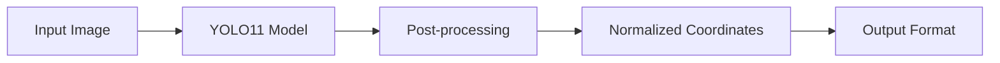

# YOLO11 Solution for UAV People Detection

## Description

This solution implements a standard YOLO11-based approach for detecting people in UAV (drone) imagery. It uses the Ultralytics YOLO framework with a fine-tuned model specifically trained for aerial people detection.

The solution provides a straightforward inference pipeline that processes images through a single YOLO model and returns normalized bounding box coordinates for detected people.

## Files and Their Purposes

### Core Files
- **`solution.py`** - Main inference script containing the `predict()` function required by the hackathon platform
- **`metadata.json`** - Docker configuration specifying the base image (`ultralytics/ultralytics:latest`)
- **`train.py`** - Training script for fine-tuning YOLO11n model on the UAV people dataset

### Expected Files (not in repository)
- **`best.pt`** - Trained YOLO model weights (generated after training or provided separately)
- **`project_root/data/merged/uav_people.yaml`** - Dataset configuration file for training

## Solution Architecture



### Key Parameters
- **Image Size**: 928px
- **Device**: GPU (device=0)
- **Model**: YOLO11n fine-tuned on UAV people data
- **Output**: Normalized bounding boxes (xc, yc, w, h) with confidence scores

## Docker Setup

This solution uses the official Ultralytics Docker image which includes all necessary dependencies for YOLO inference.

### Current Configuration
The [`metadata.json`](metadata.json:2) specifies:
```json
{
    "image": "ultralytics/ultralytics:latest"
}
```

## Training

To train the model:

1. Ensure dataset is available at `project_root/data/merged/uav_people.yaml`
2. Run the training script from project root:
```bash
python solutions/grisha/yolo11/train.py
```

The trained model will be saved to `solutions/grisha/yolo11/finetuned/weights/best.pt`
