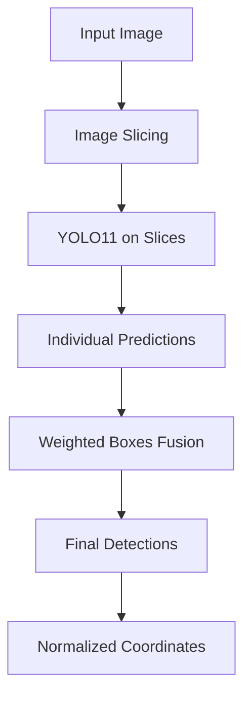

# YOLO11 Sliced Solution for UAV People Detection (in progress)

## Description

This solution implements an advanced YOLO11-based approach using **SAHI (Slicing Aided Hyper Inference)** and **Weighted Boxes Fusion (WBF)** for detecting people in UAV (drone) imagery. This method is specifically designed to improve detection performance on small objects by slicing large images into smaller patches and then combining predictions using ensemble techniques.

The solution is particularly effective for aerial imagery where people appear as small objects and may be missed by standard inference approaches.

## Files and Their Purposes

### Core Files
- **`solution.py`** - Main inference script with sliced prediction and WBF ensemble
- **`metadata.json`** - Docker configuration (currently placeholder - needs custom image)
- **`Dockerfile`** - Custom Docker setup adding SAHI and ensemble-boxes dependencies
- **`train.py`** - Training script for fine-tuning YOLO11n model on the UAV people dataset
- **`tune_inference_params.py`** - Hyperparameter optimization script for inference parameters

### Expected Files (not in repository)
- **`best.pt`** - Trained YOLO model weights (generated after training or provided separately)
- **`project_root/data/merged/uav_people.yaml`** - Dataset configuration file for training
- **`val_gt.csv`** - Validation ground truth for hyperparameter tuning

## Solution Architecture



### Key Parameters
- **Slice Size**: 1024x1024 pixels
- **Overlap**: 20% between adjacent slices
- **Confidence Threshold**: 0.12
- **WBF IoU Threshold**: 0.55
- **Device**: GPU (device="0")

### Advanced Features
1. **Sliced Inference**: Processes large images in overlapping 1024px patches
2. **Ensemble Fusion**: Combines predictions from all slices using WBF
3. **Hyperparameter Tuning**: Includes optimization script for inference parameters
4. **Low Confidence**: Uses lower threshold (0.12) to catch more small objects

## Docker Setup

### Current Status
The [`metadata.json`](metadata.json:2) contains a placeholder:
```json
{
    "image": "your/dockerhub/image"
}
```

### Building and Publishing Custom Docker Image

This solution **requires** a custom Docker image because it needs additional dependencies (`sahi` and `ensemble-boxes`).

#### Step 1: Build the Docker Image
```bash
cd solutions/grisha/yolo11_sliced/
docker build -t your-dockerhub-username/yolo11-sliced-uav:latest .
```

#### Step 2: Test the Image Locally
```bash
# Test that dependencies are installed
docker run --rm your-dockerhub-username/yolo11-sliced-uav:latest python -c "import sahi; import ensemble_boxes; print('Dependencies OK')"
```

#### Step 3: Push to Docker Hub
```bash
# Login to Docker Hub
docker login

# Push the image
docker push your-dockerhub-username/yolo11-sliced-uav:latest
```

#### Step 4: Update metadata.json
```json
{
    "image": "your-dockerhub-username/yolo11-sliced-uav:latest"
}
```

### Dockerfile Explanation
The included [`Dockerfile`](Dockerfile) extends the official Ultralytics image:
```dockerfile
FROM ultralytics/ultralytics:latest

# Install additional dependencies for sliced inference
RUN pip install --no-cache-dir sahi ensemble-boxes && pip cache purge

WORKDIR /workspace
```

## Training

To train the model:
```bash
python solutions/grisha/yolo11_sliced/train.py
```

The trained model will be saved to `solutions/grisha/yolo11_sliced/finetuned/weights/best.pt`.

## Hyperparameter Tuning

To optimize inference parameters:
```bash
python solutions/grisha/yolo11_sliced/tune_inference_params.py
```

This will use Optuna to find optimal values for:
- Confidence threshold
- Overlap ratio
- WBF IoU threshold

Results are saved to `solutions/grisha/yolo11_sliced/best_infer.json`.
